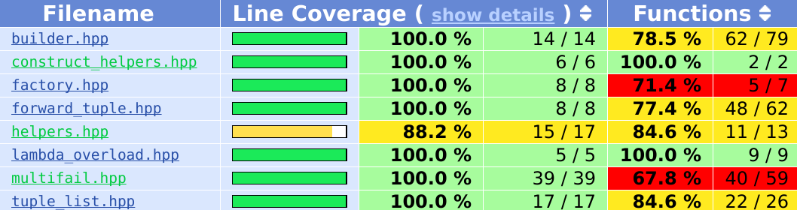

[](https://travis-ci.org/mikezackles/piecewise)
[](https://ci.appveyor.com/project/mikezackles/piecewise)

_Disclaimer_: This project is still experimental. It may not work as advertised.

Overview
--

Piecewise is a library for structuring code via compile-time dependency
injection and a pattern matching approach to error handling. In particular, it
aims to facilitate type composition hierarchies with strong invariants. It does
not use exceptions. A C++14-capable compiler and standard library are required.

```c++
// This is a temporary -- don't store it!
Foo::builder(
  Bar::builder("abc", 42)
, Baz::builder("xyzzy")
).construct(
  [](auto builder) {
    // We now know we can construct a valid Foo! Do so using arguments perfectly
    // forwarded to the nested types Bar and Baz
    Foo result = builder.construct();
    // Use it here!
    std::cout << result.bar().get_string(); // "abc"
    std::cout << result.bar().get_int();    // 42
    std::cout << result.baz().get_string(); // "xyzzy"
  }
, [](auto error) {
    std::cerr << "Validation failed: " << decltype(error)::description << std::endl;
  }
);

// Or save it for later as a std::variant
auto saved = Foo::variant<Error1, Error2>(
  Bar::builder("abc", 42)
, Baz::builder("xyzzy")
);
```

Test Matrix
--

This table attempts to document the configurations that are currently tested by
CI. Assume that compiler versions are the latest offered in the listed
environment. Untested configurations may still work!

| Environment | Compiler | Standard Library | C++14 | C++17 | Address Sanitizer |
| --- | --- | --- | --- | --- | --- |
| [Arch Travis](https://github.com/mikkeloscar/arch-travis) | gcc | libstdc++ | yes | yes | no |
| [Arch Travis](https://github.com/mikkeloscar/arch-travis) | clang | libstdc++ | yes | disabled due to [bug](https://bugs.llvm.org//show_bug.cgi?id=33222) | disabled due to [bug1](https://github.com/google/sanitizers/issues/856), [bug2](https://github.com/google/sanitizers/issues/837) |
| Travis OS X | clang | libc++ | yes | no | no |
| AppVeyor Windows | msvc | ms | yes | no | no |

Build
--

Piecewise is header only, so you don't have to build it to use it. That said, if
you're a [meson](http://mesonbuild.com) user you
can
[use piecewise as a subproject](http://mesonbuild.com/Wrap-dependency-system-manual.html)!

If you'd like to build the tests:

* [Install meson](http://mesonbuild.com/Getting-meson.html) with pip or your preferred package manager
* Install the [ninja build system](https://ninja-build.org/)
* `meson build` generates a ninja build inside the build directory (use the `CXX` env var to control the compiler)
* `meson test -C build` will build and run the test suite
* `meson configure -C build` will list all the knobs you can tweak

Design
--

*Builders* are piecewise's fundamental construct. They're essentially callbacks
paired with references to arguments. When the `construct` member function is
called on a `Builder` instance, the captured references are perfectly forwarded
to the callback, along with any arguments to `construct`. Since builders are
entirely composed of references, you should treat them as such! If you try to
use the builders outside the scope of the original expression, you're likely to
have a bad time.

In piecewise, the heavy lifting for construction moves to the static
`Foo::factory` function.
```c++
  static CONSTEXPR_LAMBDA auto factory() {
    return [](
      auto&& on_success, auto&& on_fail
    , auto t_builder, auto u_builder, auto v_builder
    , int an_int_
    ) {
      return mp::multifail(
        Aggregate::braced_constructor()
      , on_success
      , on_fail
      , mp::builders(
          std::move(t_builder), std::move(u_builder), std::move(v_builder)
        )
      , mp::arguments(an_int_)
      );
    };
  }
```

*Helpers* help you design a piecewise-enabled type. They are mix-ins implemented
using
[CRTP](https://en.wikipedia.org/wiki/Curiously_recurring_template_pattern). If
you want to keep your implementation details private, they require friendship
with your derived class:

```c++
using mp = mz::piecewise;
class Foo final
  : private mp::ConstructorHelper<Foo>
  , public mp::BuilderHelper<Foo>
  , public mp::VariantHelper<Foo>
{
  friend mp::ConstructorHelper<Foo>;
  friend mp::BuilderHelper<Foo>;
  friend mp::VariantHelper<Foo>;
```

`ConstructorHelper` gives access to the helper functions `Foo::constructor` and
`Foo::braced_constructor`. These return callables that do what you'd think.
Notice that this helper uses private inheritance to avoid exposing `Foo`'s
constructor to client code.

`BuilderHelper` creates the `Foo::builder` function. It requires a user-defined
`Foo::factory` that returns a callable. This callable is what does the heavy
lifting for constructing your type. All error handling happens here.

`VariantHelper` creates the templated `Foo::variant` function, which creates a
`std::variant` containing either a `Foo` instance or one of the enumerated error
types. Use it normally with `std::visit`.

Coverage
--



See [here](test/multifail.cpp) for a more complex example.
